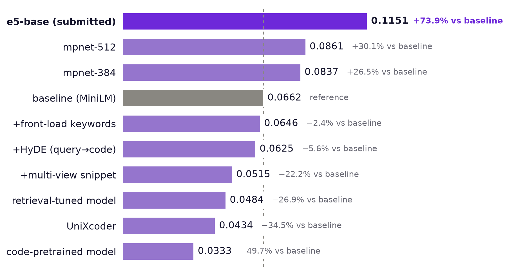
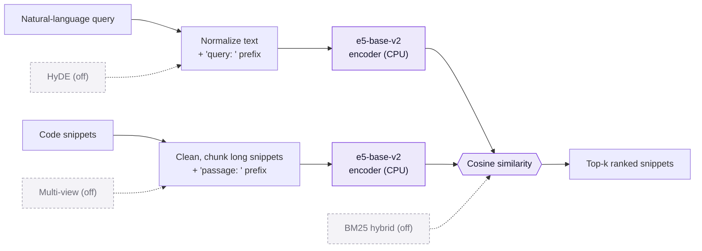

<div align="center">

# PRISM Code Search

**CPU-friendly code retrieval: a natural-language query goes in, ranked code snippets come out.**

PRISM GenAI Hackathon 2026 · Theme 1: Agentic Code Intelligence<br>
Team Trace · Thapar Institute of Engineering and Technology, Patiala


[Results](#results) · [How it works](#how-it-works) · [Quickstart](#quickstart) · [Cross-version retrieval](#cross-version-retrieval-p1-and-bonus) · [Limitations](#limitations)

</div>

## At a glance

Given a natural-language query and a library of code snippets, the system ranks the
snippets by relevance. It is scored by [MTEB](https://github.com/embeddings-benchmark/mteb)
on the CoIR **AppsRetrieval** test split (3,765 queries, 8,765 snippets) with NDCG@10 and MRR.

| | Submitted result |
|---|---|
| **NDCG@10** | **0.1151** (MiniLM baseline 0.0662, **+73.9%**) |
| **MRR@10** | **0.0986** (baseline 0.0561) |
| **Model** | [`intfloat/e5-base-v2`](https://huggingface.co/intfloat/e5-base-v2), 110M parameters, with its `query:` / `passage:` prefixes and a 512-token window |
| **Hardware** | CPU only. About 42 ms per query end to end; the full evaluation takes about 84 minutes on a free Kaggle CPU |
| **Config** | [`config/e5_base.json`](config/e5_base.json) |

| Submission contents | Where |
|---|---|
| MTEB results JSON | [Release `PRISM_GENAI_HACKATHON_Y2026`](https://github.com/Ajha2005/samsung-prism/releases/tag/PRISM_GENAI_HACKATHON_Y2026) |
| Slides | [PPTX](submission/Thapar_Trace_Submission_ppt.pptx) · [PDF](submission/Thapar_Trace_Submission_ppt.pdf) |
| Demo video | [YouTube](https://youtu.be/qD0DrWegOMI) |
| AI usage disclosure | [PDF](submission/Thapar_Trace_AI_Disclosure.pdf) · [DOCX](submission/Thapar_Trace_AI_Disclosure.docx) |
| Experiment record | [`docs/ablation_log.md`](docs/ablation_log.md) |
| Design notes | [`docs/architecture.md`](docs/architecture.md) |

### What the challenge asked for

| Goal | Status | Code |
|---|---|---|
| **P0: retrieval accuracy** | NDCG@10 0.1151, MRR@10 0.0986 on the real test split | [`prism/encoder.py`](prism/encoder.py) |
| **P1: retrieval across versions** | Working. A new version re-encodes only the snippets that changed (1 of 18 in the demo) | [`prism/index/versioned.py`](prism/index/versioned.py) |
| **Bonus: evolutionary retrieval** | Prototype with no measured gain yet: it ties plain retrieval ([details](#cross-version-retrieval-p1-and-bonus)) | [`prism/index/evolutionary.py`](prism/index/evolutionary.py) |

## Results

We measured ten configurations on the real test split, one change at a time against the
same baseline, and kept the one that scored best.



- **What moved the score:** a larger general model (mpnet, +26.5%), a longer input window
  (384 to 512 tokens, +2.9%), and a model trained for query-to-passage retrieval
  (e5-base-v2, +33.7% over mpnet at the same size).
- **What did not:** HyDE (−6%), multi-view snippets (−22%), keyword front-loading (−2.4%),
  and every code-specialized model (UniXcoder −34.5%, CodeSearchNet −50%). They stay in
  the repo, switched off.
- **Sanity check:** the e5-base-v2 score is in line with the published CoIR result for that
  model on this task (about 11.5 NDCG@10), so the MTEB wiring and the prefixes are right.

<details>
<summary>Full table (NDCG@10 on the real test split)</summary>

| Config | NDCG@10 | vs baseline |
|---|---:|---:|
| **e5-base-v2, query/passage prefixes (submitted)** | **0.1151** | **+73.9%** |
| mpnet, 512-token window | 0.0861 | +30.1% |
| mpnet, 384-token window | 0.0837 | +26.5% |
| baseline: all-MiniLM-L6-v2 | 0.0662 | n/a |
| + front-loaded keywords | 0.0646 | −2.4% |
| + HyDE | 0.0625 | −6% |
| + multi-view | 0.0515 | −22% |
| retrieval-tuned `multi-qa-MiniLM-L6-cos-v1` | 0.0484 | −27% |
| `microsoft/unixcoder-base` | 0.0434 | −34.5% |
| CodeSearchNet `st-codesearch-distilroberta-base` | 0.0333 | −50% |

Reasons and MRR@10 for every row are in [`docs/ablation_log.md`](docs/ablation_log.md).

</details>

## How it works

MTEB scores an *encoder*: it embeds queries and snippets into one vector space and ranks
by cosine similarity. So every stage is either a text transformation before the model or a
vector operation after it, which keeps the whole system a drop-in MTEB encoder
([`PrePostPipelineEncoder`](prism/encoder.py)).



In the submitted run:

1. **Query:** whitespace normalization, then the `query: ` prefix e5 expects.
2. **Snippet:** cleanup, chunking of very long snippets (chunk vectors are max-pooled back
   into one), then the `passage: ` prefix.
3. **Score:** cosine similarity between the query vector and every snippet vector.

**Optional layers.** Built, tested and measured on the real split, but off in the submission
because they lost. Each is a config flag, so anyone can re-measure them:

| Layer | Idea | Real-split result |
|---|---|---|
| Query-to-code HyDE ([`hyde.py`](prism/query/hyde.py)) | Turn the query into a short code sketch with a deterministic template (no LLM) and blend its embedding in | −6% |
| Multi-view snippets ([`multiview.py`](prism/snippet/multiview.py)) | Fuse raw code, an AST-normalized skeleton and an identifier bag into one vector | −22% |
| Keyword front-loading ([`preprocess.py`](prism/query/preprocess.py)) | Put extracted keywords first so they survive a short tokenizer window | −2.4% |
| Hybrid dense + BM25 ([`scoring/`](prism/scoring)) | Rank fusion in the standalone retriever; MTEB scores the pure encoder, so it cannot affect the submission | n/a |

## Quickstart

### 1. Offline, no downloads

```bash
git clone https://github.com/Ajha2005/samsung-prism.git && cd samsung-prism
pip install -e ".[dev]"        # numpy, rank-bm25, pytest
python -m pytest -q            # 78 tests; the 3 MTEB-integration tests skip if mteb is not installed
python -m prism.cli demo --backend hashing
```

```text
Q: find two numbers that sum to a target   (0.7 ms)
  1. [two_sum]  score=0.3810   def two_sum(nums, target):
  2. [binary_search]  score=0.1483   def binary_search(arr, target):
  3. [lru_cache_manual]  score=0.0785   from collections import OrderedDict
```

The offline `hashing` backend is a deterministic lexical embedder for tests and CI. It is
**not** the competition model, so its scores are not comparable to the real ones.

### 2. Demo with the submitted model

```bash
pip install -r requirements.txt -r requirements-eval.txt && pip install -e .
python -m prism.cli demo --config config/e5_base.json \
    --query "given a list of meeting times, collapse the ones that overlap"
```

`--query` is repeatable and takes any natural-language query. The demo prints the ranked
snippets, the latency (end to end, and the ranking step alone), and which embedding model
actually loaded. If the model cannot be downloaded it falls back to the offline backend and
prints a `WARNING` saying so.

### 3. Reproduce the leaderboard result

```bash
pip install -r requirements.txt -r requirements-eval.txt && pip install -e .
python -m prism.cli eval --config config/e5_base.json --output results/appsretrieval_results.json
```

`make eval` runs the same command. It downloads the model and the dataset on first use and
takes about 1.5 hours on a CPU. The output is the raw MTEB `task_result.to_dict()`, exactly
as the problem statement's reference snippet writes it (`scores.test[0].ndcg_at_10`).
A leaderboard run never substitutes a different model when the requested one fails to
load; it raises instead, so a reported score always belongs to the model in the config.

Any other config re-runs the same way, for example
`--config config/baseline.json --output results/baseline_appsretrieval_results.json`.

### 4. Docker

```bash
docker build -t prism-code-search .
docker run --rm prism-code-search          # offline: tests + demo
docker run --rm -v "$PWD/results:/app/results" prism-code-search \
    python -m prism.cli eval --config config/e5_base.json --output results/appsretrieval_results.json
```

<details>
<summary>Models that need <code>trust_remote_code</code></summary>

Some code-specialized models (for example Jina's code embedding models) ship custom modeling
code fetched from the Hub, and need `trust_remote_code` (set it in the config or pass
`--trust-remote-code`). Use it only for a repository you trust, since it executes code from
that repository. That code is tied to the `transformers` version it was written for and can
fail to import on a newer release, which is what happened with
`jina-embeddings-v2-base-code` during this project.

</details>

## Cross-version retrieval (P1 and bonus)

`python -m prism.cli demo --backend hashing --versioned` (or `--config config/e5_base.json`
for the real model):

```text
1) Cheap versioned index rebuild (only changed snippets re-encoded):
     v1: encoded 18/18 snippets  in    4.8 ms
     v2: encoded 1/18 snippets  in    0.4 ms (cache hit 94%, ~12x faster rebuild)

2) stable-core + version-delta decomposition (group 'sort'):
     shared core : def sort_items(items):
     v0 delta    : return sorted(items)
     v1 delta    : return sorted(items, reverse=True)
     v2 delta    : return sorted(items, key=lambda x: abs(x))

3) Version-specific retrieval (8 targeted queries, delta_weight=1.0):
     representation            P@1   NDCG@3
     naive full-text         0.625    0.766
     stable-core + delta     0.625    0.766
```

- **What works (P1).** The index is content-addressed: a new version re-encodes only the
  snippets whose content changed and reuses cached vectors for the rest.
- **What does not, yet (bonus).** The stable-core + version-delta representation
  (`vector = normalize(base + delta_weight · delta)`) is meant to pull a version-specific
  query toward the right sibling. In our tests it ties plain retrieval, on the offline
  backend and on e5-base-v2, so we report it as a prototype with no measured gain.

## Repository layout

```text
prism/
  encoder.py      MTEB-scored encoder (PrePostPipelineEncoder)
  pipeline.py     standalone retriever used by the demo
  config.py       one config object per experiment
  cli.py          prism-eval, prism-demo, prism-ablation
  backends/       sentence-transformers (real) and hashing (offline) embedders
  query/          normalization, keywords, HyDE
  snippet/        cleanup, chunking, AST normalization, multi-view
  scoring/        BM25 and rank fusion
  index/          versioned index, stable-core + version-delta
  telemetry/      trec_eval-compatible metrics and timing
  eval/           MTEB runner and an offline synthetic MTEB task
config/           e5_base.json (submitted) and the other configs measured
tests/            78 tests
docs/             architecture.md, ablation_log.md, assets/
submission/       slides (PPTX, PDF) and the AI usage disclosure
Dockerfile · Makefile · requirements*.txt · pyproject.toml
```

## Limitations

- **The pre/post-processing layers did not help.** HyDE, multi-view and front-loading all
  lost to plain MiniLM on the real split. They have not been re-measured on top of e5,
  where they may behave differently.
- **Larger models are untested.** e5-base-v2 has 110M parameters; bigger ones (for example
  e5-large) may score higher but cost roughly 3× the CPU time.
- **The bonus is a prototype** with no measured gain (see above).
- **Scores on this task are low in absolute terms.** The queries are long problem statements
  from competitive programming, matched against full solutions, which is hard for CPU-sized
  models.
- **The offline `hashing` backend is lexical**, so offline numbers say nothing about the
  real model's quality.

## AI assistance

Most of this repository (code, tests, documentation and slides) was written with Claude Code,
Anthropic's coding assistant, from my instructions. I directed the work, ran every
experiment on my own Kaggle, Colab and PC accounts, and decided what to submit. The AI usage
disclosure form is in [`submission/Thapar_Trace_AI_Disclosure.pdf`](submission/Thapar_Trace_AI_Disclosure.pdf).

## License and credits

MIT, see [LICENSE](LICENSE). Built by Abhavya Jha (Team Trace, Thapar Institute of
Engineering and Technology) for the PRISM GenAI Hackathon 2026. Thanks to the authors of
[MTEB](https://github.com/embeddings-benchmark/mteb), [CoIR](https://github.com/CoIR-team/coir),
[sentence-transformers](https://www.sbert.net/) and [E5](https://huggingface.co/intfloat/e5-base-v2).
